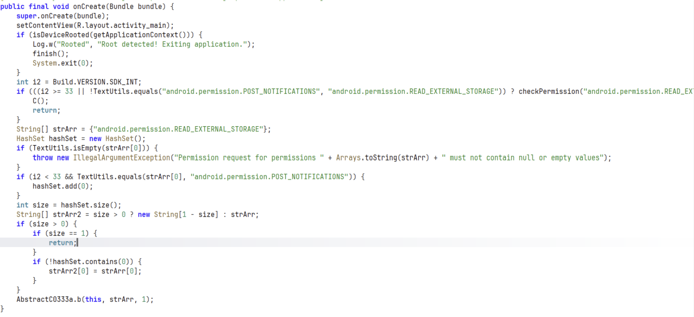
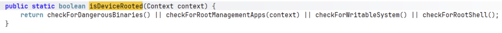
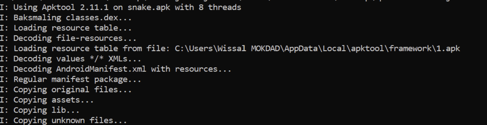
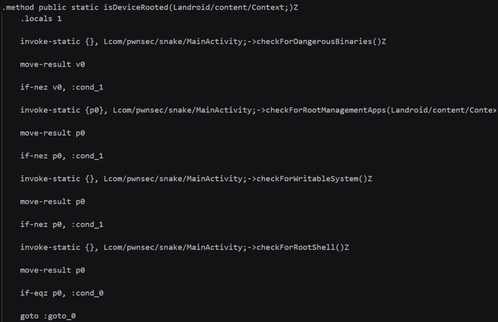
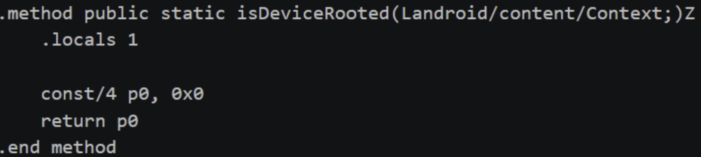
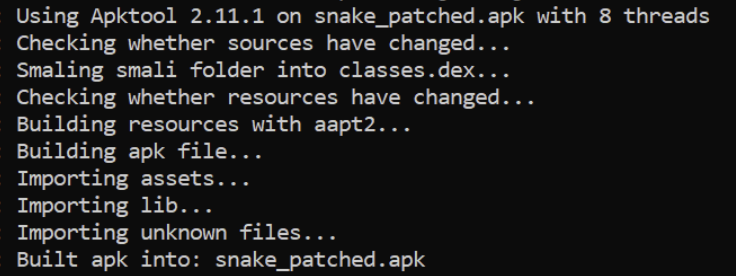
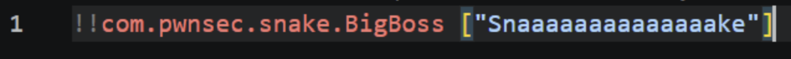
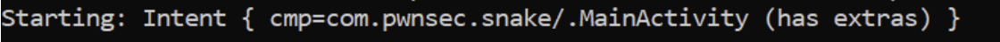
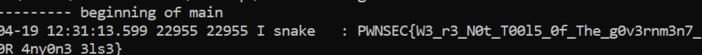

# LAB 19 – Snake : Exploitation de désérialisation YAML (CVE-2022-1471) sur Android

**Auteur :** Oumayma Benhilal  
**Cours :** Sécurité des applications mobiles  

## Objectif du challenge (Niveau Hard)
L’application Android "Snake" (issue du PwnSec CTF 2024) implémente de multiples mécanismes de protection : détection de root, d’émulateur et détection native de Frida. Elle lit un fichier YAML depuis le stockage externe et le parse en utilisant une version vulnérable de **SnakeYAML** (CVE-2022-1471).

L’objectif est double :
1. **Patcher statiquement l'APK** (Smali) pour contourner les détections puisque Frida est neutralisé par la librairie native.
2. **Exploiter la désérialisation unsafe** pour forcer l'instanciation d'une classe cachée (`BigBoss`) qui, via JNI, génère et affiche le flag dans le logcat Android.

---

## Prérequis
- APK `Snake.apk`.
- Émulateur Android rooté (ou appareil physique).
- Outils d'analyse et de reverse : **Jadx-GUI**, **apktool**, `apksigner`.
- Outils de débogage Android : `adb` (shell, am start, logcat).
- Compréhension des concepts de désérialisation Java/YAML.

---

## Déroulement du Lab

### Étape 1 – Préparation de l’environnement (Constat d'échec)

Dès l'installation et le premier lancement de l'application sur notre émulateur, l'application se ferme immédiatement. Le code source révèle rapidement pourquoi : un check de sécurité strict.

L'application appelle `isDeviceRooted()` et, si le résultat est vrai, elle affiche un message dans les logs et se ferme brutalement.

### Étape 2 – Analyse statique approfondie avec Jadx

En explorant le code décompilé avec Jadx, nous localisons la méthode `isDeviceRooted()` qui regroupe plusieurs vérifications (binaires dangereux, applications de gestion root, shell root, etc.).

Plus loin dans le code (non illustré ici, mais présent dans l'APK), on trouve l'utilisation vulnérable de `Yaml.load()` et l'existence d'une classe "fantôme" nommée `BigBoss`, qui n'est jamais instanciée par le flux normal, mais qui contient l'appel JNI générant le flag si on lui passe la chaîne secrète (ex: "Snaaaaaaaaaaaaaaaake").

### Étape 3 – Patch Smali pour bypasser les détections

Frida étant bloqué, nous devons modifier le bytecode de l'application. On décompile l'APK avec apktool :

On navigue jusqu'au fichier Smali contenant la fonction `isDeviceRooted()`.

Nous modifions ce code Smali pour court-circuiter toute la logique. Nous forçons la méthode à retourner `false` (0) inconditionnellement :

Ensuite, nous recompilons l'application avec apktool :

*(N'oubliez pas de signer l'APK avec `apksigner` avant de l'installer !)*

### Étape 4 – Création du payload YAML (CVE-2022-1471)

L'application vulnérable désérialise les données YAML sans restriction de type (unsafe). Nous pouvons donc forcer SnakeYAML à créer un objet de la classe `com.pwnsec.snake.BigBoss` en utilisant le tag YAML spécifique `!!` suivi du nom complet de la classe, et en lui passant le paramètre attendu par son constructeur.

*Contenu du payload : `!!com.pwnsec.snake.BigBoss ["Snaaaaaaaaaaaaaaaake"]`*

### Étape 5 – Lancement de l’application avec l’Intent approprié

Le payload YAML doit être placé sur le stockage de l'appareil (ex: `/sdcard/payload.yaml`). L'application attend probablement le chemin de ce fichier via un Intent. Nous utilisons `adb` pour lancer l'Activity principale et lui fournir le fichier.

### Étape 6 – Récupération du flag via logcat

L'application lit le fichier, SnakeYAML instancie la classe `BigBoss`, la chaîne de caractères déclenche la fonction JNI, et le flag est écrit dans les logs système. On l'intercepte avec `logcat` :

**FLAG récupéré :** `PWNSEC{W3_r3_N0t_T00l5_0f_The_g0v3rnm3n7_0R_4ny0n3_3ls3}`

---

## Dépannage (FAQ)

- **L'application se ferme toujours après le patch :** Avez-vous bien patché toutes les vérifications ? L'APK inclut peut-être une vérification de signature ou d'intégrité CRC. Assurez-vous de patcher également l'anti-émulateur si vous êtes sur un AVD.
- **YAMLException / ClassNotFoundException :** Vérifiez l'orthographe exacte du package et de la classe `BigBoss` dans votre payload YAML.
- **Rien dans logcat :** Assurez-vous de ne pas filtrer trop agressivement. Filtrez simplement sur `adb logcat | grep PWNSEC` ou regardez les logs du PID de l'application.

## Conclusion personnelle
Ce lab "Hard" est une excellente démonstration que l'analyse dynamique (Frida) n'est pas toujours la solution magique. Face à des protections natives robustes, le retour aux sources avec le patching Smali reste une compétence indispensable. De plus, l'exploitation d'une vulnérabilité logique (désérialisation) issue du monde Web/Java classique appliquée à l'environnement Android montre l'importance de sécuriser les dépendances (SCA) dans les applications mobiles.
